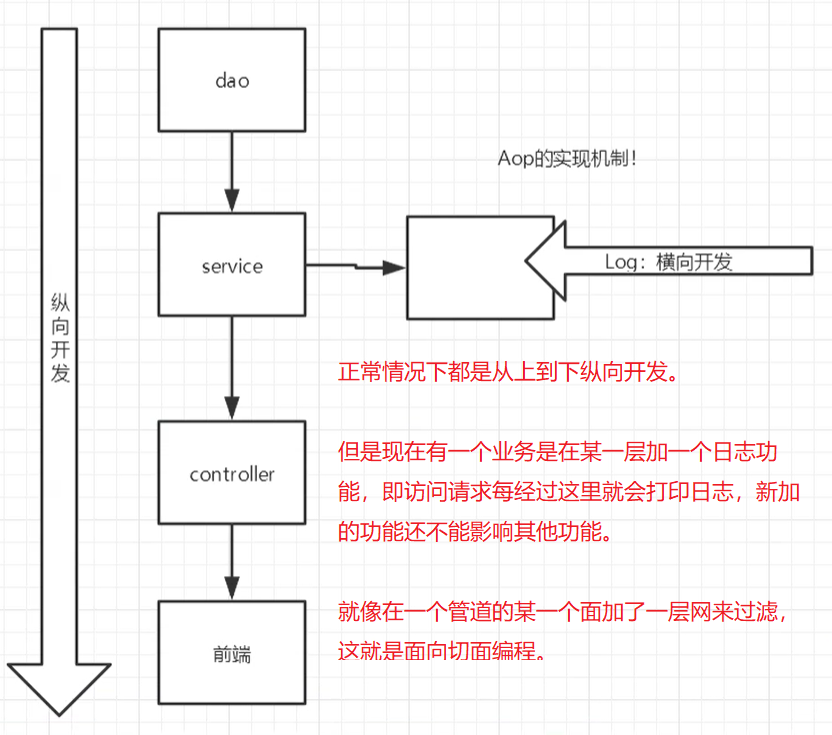

# Spring-study

https://github.com/yury757/SpringStudy

<font color="Red">spring：约定大于配置！</font>

## 一、IOC（控制反转）

### 1、什么是IOC	

之前都是我们手动new一个对象（比如new一个Dao层对象），然后使用这个对象的属性的方法。

而IOC就是不用我们去new这个对象，我们只要定义一些配置，然后把创建对象的工作交给spring框架处理，我们需要使用时直接把对象从IOC容器中取出来即可。

<font color="Red">因此IOC（控制反转）的含义就是：spring中，对象创建的权利从我们程序员手动创建控制管理，转变为由spring框架去创建控制管理。</font>

<font color="Red">DI（依赖注入）的含义就是：spring框架在创建类的实例时，这个类的所有属性需要私有化，并且设置getter、setter方法，spring框架就可以通过setter方法给对应属性注入值。若没有相应的setter方法，则会报错。</font>

配置如下：

```xml
<?xml version="1.0" encoding="UTF-8"?>
<beans xmlns="http://www.springframework.org/schema/beans"
       xmlns:xsi="http://www.w3.org/2001/XMLSchema-instance"
       xsi:schemaLocation="http://www.springframework.org/schema/beans
        https://www.springframework.org/schema/beans/spring-beans.xsd">

    <!-- 使用spring来创建对象，在spring中，这些对象都叫做bean -->
    <!-- id：唯一id -->
    <!-- class：需要new的类型 -->
    <!-- property：对象的属性 -->
    <!-- property.name：对象属性名 -->
    <!-- property.value：对象属性设置值 -->
    <bean id="hello" class="org.yuyr757.pojo.Hello">
        <property name="str" value="spring_value"/>
    </bean>
</beans>
```

取出对象的代码如下：

```java
// 获取spring的上下文对象
ApplicationContext context = new ClassPathXmlApplicationContext("beans.xml");
// 我们的对象都在spring管理，我们要使用的话，直接去spring容器里面取
Hello hello = (Hello)context.getBean("hello");
System.out.println(hello.toString());
```

和Mybatis有点像，都是通过配置文件来配置创建对象所需要的东西，然后把创建对象的工作交给框架来做。

<font color="Red">只不过Mybatis是根据接口创建对象，这个对象的类型的java代码我们甚至没写过，而且对象里面只有方法（CRUD）。而spring的创建对象只是单纯的根据我们写好的java类去new一个实例，然后我们需要什么就取什么。</font>

### 2、通过bean创建对象的四种方式

```xml
<!-- 无参构造，再调用相应属性的setter方法 -->
<bean id="user1" class="org.yuyr757.pojo.User">
    <property name="id" value="1"/>
    <property name="name" value="test_user_name1"/>
</bean>

<!-- 有参构造，使用构造方法参数下标 -->
<bean id="user2" class="org.yuyr757.pojo.User">
    <constructor-arg index="0" value="2"/>
    <constructor-arg index="1" value="test_user_name2"/>
</bean>

<!-- 有参构造，使用构造方法参数类型 -->
<!-- 不建议使用 -->
<bean id="user3" class="org.yuyr757.pojo.User">
    <constructor-arg type="int" value="3"/>
    <constructor-arg type="java.lang.String" value="test_user_name3"/>
</bean>

<!-- 有参构造，使用构造方法参数参数名 -->
<bean id="user4" class="org.yuyr757.pojo.User">
    <constructor-arg name="id" value="4"/>
    <constructor-arg name="name" value="test_user_name4"/>
</bean>
```

### 3、spring创建对象的时间

<font color="Red">值得注意的是，bean默认为单例模式。对于单例模式的bean，当程序启动时，spring就会立即给帮我们把对象创建好了，而不是等我们调用getBean时创建的。</font>

```java
package org.yuyr757.pojo;

public class User {
    private int id;
    private String name;
    public User() {
        System.out.println("调用了无参构造方法");
    }
    public User(int id, String name) {
        System.out.println("调用了有参构造方法");
        this.id = id;
        this.name = name;
    }
    public String getName() {
        System.out.println("调用了getName方法");
        return name;
    }
    public void setName(String name) {
        System.out.println("调用了setName方法");
        this.name = name;
    }
    public int getId() {
        System.out.println("调用了getId方法");
        return id;
    }
    public void setId(int id) {
        System.out.println("调用了setId方法");
        this.id = id;
    }
    @Override
    public String toString() {
        return "User{" +
                "id=" + id +
                ", name='" + name + '\'' +
                '}';
    }
}
```

```java
public class TestHello {
    public static final ApplicationContext context;

    static{
        context = new ClassPathXmlApplicationContext("beans.xml"); // 在这里打断点调试
        // 上面这条语句结束后，就立即打印了下面几句话
        // 调用了无参构造方法
        // 调用了setId方法
        // 调用了setName方法
        // 调用了有参构造方法
        // 调用了有参构造方法
        // 调用了有参构造方法
    }
    
    @Test
    public void testUser(){
        System.out.println("=============================");
        User user1 = (User)context.getBean("user1");
        System.out.println(user1.toString());
        System.out.println("=============================");
        User user2 = (User)context.getBean("user2");
        System.out.println(user2.toString());
        System.out.println("=============================");
        User user3 = (User)context.getBean("user3");
        System.out.println(user3.toString());
        System.out.println("=============================");
        User user4 = (User)context.getBean("user4");
        System.out.println(user4.toString());
        System.out.println("=============================");
    }
}
```

### 4、spring配置文件

#### （1）bean标签

- `id`：唯一id，用于获取到这个对象的id

- `class`：需要new的类型，要写全限定类名

- `property`：定义对象的属性的标签

- `constructor-arg`：定义构造函数的标签

    - `name`：对象属性名或构造函数的参数名
    - `value`：普通值
    - `ref`：引用一个bean
    - `array`：注入一个数组
    - `list`：注入一个列表
    - `map`：注入一个映射表
    - `set`：注入一个集合
    - `null`：注入一个null指针
    - `props`：注入一个properties对象
- `scope`：作用域

#### （2）import标签

导入其他bean配置文件。

适用于团队开发，不同的人开发的bean不同，最终汇总的时候用一个applicationContext.xml引入各个bean.xml即可。

```xml
<import resource="beans.xml"/>
<import resource="beans2.xml"/>
<import resource="beans3.xml"/>
```

### 5、注入方式

#### （1）普通方式

```java
package org.yuyr757.pojo;

import java.util.*;

public class Student {
    private String name;
    private Address address;
    private String[] books;
    private List<String> hobbies;
    private Map<String, String> card;
    private Set<String> games;
    private String wife;
    private Properties info;

    @Override
    public String toString() {
        return "Student{" +
                "name='" + name + '\'' +
                ", address=" + address +
                ", books=" + Arrays.toString(books) +
                ", hobbies=" + hobbies +
                ", card=" + card +
                ", games=" + games +
                ", info=" + info +
                ", wife='" + wife + '\'' +
                '}';
    }

    public String getName() {
        return name;
    }

    public void setName(String name) {
        this.name = name;
    }

    public Address getAddress() {
        return address;
    }

    public void setAddress(Address address) {
        this.address = address;
    }

    public String[] getBooks() {
        return books;
    }

    public void setBooks(String[] books) {
        this.books = books;
    }

    public List<String> getHobbies() {
        return hobbies;
    }

    public void setHobbies(List<String> hobbies) {
        this.hobbies = hobbies;
    }

    public Map<String, String> getCard() {
        return card;
    }

    public void setCard(Map<String, String> card) {
        this.card = card;
    }

    public Set<String> getGames() {
        return games;
    }

    public void setGames(Set<String> games) {
        this.games = games;
    }

    public Properties getInfo() {
        return info;
    }

    public void setInfo(Properties info) {
        this.info = info;
    }

    public String getWife() {
        return wife;
    }

    public void setWife(String wife) {
        this.wife = wife;
    }

    public Student() {
    }

    public Student(String name, Address address, String[] books, List<String> hobbies, Map<String, String> card, Set<String> games, Properties info, String wife) {
        this.name = name;
        this.address = address;
        this.books = books;
        this.hobbies = hobbies;
        this.card = card;
        this.games = games;
        this.info = info;
        this.wife = wife;
    }
}
```

```java
package org.yuyr757.pojo;

public class Address {
    private String address;

    @Override
    public String toString() {
        return "Address{" +
                "address='" + address + '\'' +
                '}';
    }

    public String getAddress() {
        return address;
    }

    public void setAddress(String address) {
        this.address = address;
    }

    public Address() {
    }

    public Address(String address) {
        this.address = address;
    }
}
```

```xml
<?xml version="1.0" encoding="UTF-8"?>
<beans xmlns="http://www.springframework.org/schema/beans"
       xmlns:xsi="http://www.w3.org/2001/XMLSchema-instance"
       xsi:schemaLocation="http://www.springframework.org/schema/beans
        https://www.springframework.org/schema/beans/spring-beans.xsd">

    <!-- 测试特别复杂类型的注入 -->
    <bean id="student" class="org.yuyr757.pojo.Student">
        <!-- 普通值，value -->
        <property name="name" value="yuyr757"/>

        <!-- bean注入，ref -->
        <property name="address" ref="address"/>

        <!-- 数组注入，array -->
        <property name="books">
            <array>
                <value>红楼梦</value>
                <value>水浒传</value>
                <value>西游记</value>
                <value>三国演义</value>
            </array>
        </property>

        <!-- 列表注入，list -->
        <property name="hobbies">
            <list>
                <value>听歌</value>
                <value>写代码</value>
                <value>看电影</value>
            </list>
        </property>

        <!-- 映射表注入，map -->
        <property name="card">
            <map>
                <entry key="身份证" value="111111111111111111"/>
                <entry key="银行卡" value="222222222222222222"/>
            </map>
        </property>

        <!-- 集合注入，set -->
        <property name="games">
            <set>
                <value>魂斗罗</value>
                <value>冒险岛</value>
                <value>七龙珠</value>
            </set>
        </property>

        <!-- null注入，null -->
        <property name="wife">
            <null/>
        </property>

        <!-- properties对象注入，props，注意和map的区别 -->
        <property name="info">
            <props>
                <prop key="学号">U201300001</prop>
                <prop key="性别">男</prop>
                <prop key="username">root</prop>
                <prop key="password">root</prop>
            </props>
        </property>
    </bean>

    <bean id="address" class="org.yuyr757.pojo.Address">
        <property name="address" value="我是一个地址"/>
    </bean>

</beans>
```

#### （2）拓展方式

```xml
<?xml version="1.0" encoding="UTF-8"?>
<beans xmlns="http://www.springframework.org/schema/beans"
       xmlns:xsi="http://www.w3.org/2001/XMLSchema-instance"
       xmlns:p="http://www.springframework.org/schema/p"
       xmlns:c="http://www.springframework.org/schema/c"
       xsi:schemaLocation="http://www.springframework.org/schema/beans
        https://www.springframework.org/schema/beans/spring-beans.xsd">

    <!-- 以上加入这个这个拓展标签 -->
    <!-- xmlns:p="http://www.springframework.org/schema/p" -->
    <!-- 加入这个标签后可以直接在后面使用 p:属性名 来定义属性 -->
    <bean id="user5" class="org.yuyr757.pojo.User" p:id="5" p:name="user_test_5"/>

    <!-- 以上加入这个这个拓展标签 -->
    <!-- xmlns:p="http://www.springframework.org/schema/c" -->
    <!-- 加入这个标签后可以直接在后面使用 c:属性名/下标 来定义构造方法的参数的值 -->
    <bean id="user6" class="org.yuyr757.pojo.User" c:id="6" c:name="user_test_6"/>
    <bean id="user7" class="org.yuyr757.pojo.User" c:_0="7" c:_1="user_test_7"/>
</beans>
```

### 6、bean的作用域

#### （1）singleton Scope（单例，默认）

从服务器启动到服务器消灭，全局只创建一个对象。当使用多线程时，多个线程拿到的是同一个对象（<font color="Red">注意线程的安全</font>）。

#### （2）prototype（多例）

每次调用getBean方法，都会重新new一个对象。

#### （3）request、session、application

这三个只能在web应用中使用，和servlet中的不同作用域的context差不多。

### 7、bean的自动装配

<font color="Red">即spring会在容器中自动寻找创建某个对象的依赖，并装配到这个对象的属性中。</font>有以下方式：

#### （1）在xml中显式配置

- byName：在容器中自动查找对应属性的setter方法名中set后面的值相同的bean的id
- byType：在容器中自动查找对应属性类型相同的bean，使用这种方式，一定要保证相同类型的对象只有一个bean

```xml
<?xml version="1.0" encoding="UTF-8"?>
<beans xmlns="http://www.springframework.org/schema/beans"
       xmlns:xsi="http://www.w3.org/2001/XMLSchema-instance"
       xsi:schemaLocation="http://www.springframework.org/schema/beans
        https://www.springframework.org/schema/beans/spring-beans.xsd">

    <bean id="dog" class="org.yuyr757.pojo.Dog"/>
    <bean id="cat" class="org.yuyr757.pojo.Cat"/>
<!--    <bean id="cat2" class="org.yuyr757.pojo.Cat"/>-->

    <!-- byName：在容器中自动查找对应属性的setter方法名中set后面的值相同的bean的id -->
    <bean id="people1" class="org.yuyr757.pojo.People" autowire="byName">
        <property name="name" value="这是我的名字1"/>
    </bean>
    <!-- byType：在容器中自动查找对应属性类型相同的bean -->
    <!-- 当容器中有两个相同类型的对象时，不能使用byType -->
    <bean id="people2" class="org.yuyr757.pojo.People" autowire="byType">
        <property name="name" value="这是我的名字2"/>
    </bean>
    
</beans>
```

#### （2）使用注解

要在`applicationContext.xml`中加入以下支持。

```xml
<?xml version="1.0" encoding="UTF-8"?>
<beans xmlns="http://www.springframework.org/schema/beans"
       xmlns:xsi="http://www.w3.org/2001/XMLSchema-instance"
       xmlns:context="http://www.springframework.org/schema/context"
       xsi:schemaLocation="http://www.springframework.org/schema/beans
        https://www.springframework.org/schema/beans/spring-beans.xsd
        http://www.springframework.org/schema/context
        https://www.springframework.org/schema/context/spring-context.xsd">

    <context:annotation-config/>


</beans>
```

<font color="Red">xml配置和注解的一般结合方式：在xml中配置bean，在注入属性时使用注解。</font>

### 8、注解

#### （1）普通注解

- `@Component`：作用目标：类。把该类当作一个bean对象，即相当于在配置中加入了一个bean标签，默认单例。

- `@AutoWired`：作用目标：很多，一般用于属性。为该属性通过setter方法注入一个值，相当于在配置文件中加入了一个property标签。<font color="Red">先通过byType的方法注入的，当IOC容器中有多个相同类型的对象时，再使用byName的方式来注入，而这个name默认就是根据变量名来的。</font>

- `@Qualifier`：作用目标：很多，一般用于属性。<font color="Red">通过byName自动注入，该注解有一个value属性，指定去找对应名字的bean。</font>可以和`@AutoWired`配合使用。

- `@Resources`：作用目标：很多，一般用于属性。<font color="Red">相当于以上两个注解的结合。</font>有一个name属性，用于匹配bean的名字，不填。

- `@value`：作用目标：很多，一般用于属性。为该属性通过setter方法注入一个普通的确定的值。

#### （2）衍生注解

- `Repository`：这是Component注解的别名，用于表示这个类是Dao层的类
- `Service`：这是Component注解的别名，用于表示这个类是Service层的类
- `Controller`：这是Component注解的别名，用于表示这个类是Controller层的类
- `Scope`：作用域，singleton、prototype等

### 9、使用java类来配置spring

即不需要再xml中配置spring，而是在一个SpringConfig类中配置。

- `@configuration`：在类上加入这个注解，则表明这是一个配置类。
- `@Bean`：在方法的的上面加这个注解，相当于xml中的一个bean标签，方法的名字就是bean标签的id，方法的返回值就是bean标签的class属性。
- `@Import`：引入其他配置类

```java
package org.yuyr757.config;

import org.springframework.beans.factory.annotation.Qualifier;
import org.springframework.context.annotation.Bean;
import org.springframework.context.annotation.Configuration;
import org.springframework.context.annotation.Import;
import org.yuyr757.pojo.Address;
import org.yuyr757.pojo.User;

@Configuration
@Import(MyConfig2.class)
public class MyConfig {
    @Bean
    public Address address(){
        return new Address("1");
    }

    @Bean
    public Address address2(){
        return new Address("2");
    }

    @Bean
    public User getUser(){
        return new User();
    }
}
```

```java
package org.yuyr757.pojo;

import org.springframework.beans.factory.annotation.Autowired;
import org.springframework.beans.factory.annotation.Value;

public class User {
    @Value("yuyr757")
    private String name;

    @Autowired
    private Address address;

    @Override
    public String toString() {
        return "User{" +
                "name='" + name + '\'' +
                ", address=" + address +
                '}';
    }

    public String getName() {
        return name;
    }

    public void setName(String name) {
        this.name = name;
    }

    public Address getAddress() {
        return address;
    }

    public void setAddress(Address address) {
        this.address = address;
    }

    public User() {
    }

    public User(String name, Address address) {
        this.name = name;
        this.address = address;
    }
}
```

## 二、AOP（Aspect-Oriented Programming，面向切面编程）



### 1、代理模式

#### （1）静态代理

角色：

- 抽象角色：一般使用接口或抽象类来解决
- 真实角色：被代理的角色
- 代理角色：代理真是角色，并做一些附属操作
- 客户：访问代理角色的人

以租房为例。

很多客户（租户）直接找到真实角色（房东），完成一个操作（租房）。但是要完成这个操作要很多其他繁琐的事情（比如每次都要带客户看房、签合同等），真实角色（房东）不想做这些他认为没有意义的操作。于是真实角色（房东）找到一个同样可以做这个操作（租房）的代理角色（中介），让代理角色（中介）去和客户（租户）完成看房、签合同等其他操作，真实角色（房东）就可以专心做租房这一个操作了。抽象角色指一类人，这类人都可以完成租房这个操作。在这里真实角色（房东）和代理角色（中介）都是同一类抽象角色。

<font color="Red">注意在代码中理解四类角色。</font>

- 示例一

```java
package org.yuyr757.Demo1;
// 抽象角色
public interface Rent {
    public void rent();
}
```

```java
package org.yuyr757.Demo1;
// 客户
public class Client {
    public static void main(String[] args) {
        // 直接找房东租房
        Host host = new Host();
        host.rent();

        System.out.println("======================");

        // 找中介租房
        // 通过代理可以做一些附属操作
        Proxy proxy = new Proxy(host);
        proxy.rent();
    }
}
```

```java
package org.yuyr757.Demo1;
// 房东
public class Host implements Rent{
    public void rent() {
        System.out.println("房东要出租房子");
    }
}
```

```java
package org.yuyr757.Demo1;
// 中介
public class Proxy implements Rent {
    private Host host;

    public Host getHost() {
        return host;
    }

    public void setHost(Host host) {
        this.host = host;
    }

    public Proxy() {
    }

    public Proxy(Host host) {
        this.host = host;
    }

    public void seeHouse(){
        System.out.println("中介带看房");
    }

    public void payFee(){
        System.out.println("收取中介费");
    }

    public void rent() {
        this.seeHouse();
        host.rent();
        this.payFee();
    }
}
```

- 示例二：

```java
package org.yuyr757.Demo2;

public interface UserService {
    public void add();
    public void delete();
    public void update();
    public void query();
}
```

```java
package org.yuyr757.Demo2;

public class UserServiceImpl implements UserService{
    public void add() {
        System.out.println("增加了一个用户");
    }

    public void delete() {
        System.out.println("删除了一个用户");
    }

    public void update() {
        System.out.println("修改了一个用户");
    }

    public void query() {
        System.out.println("查询了一个用户");
    }
}
```

```java
package org.yuyr757.Demo2;

public class UserServiceProxy implements UserService{
    private UserService userService;

    public UserServiceProxy() {
    }

    public UserServiceProxy(UserService userService) {
        this.userService = userService;
    }

    public UserService getUserService() {
        return userService;
    }

    public void setUserService(UserService userService) {
        this.userService = userService;
    }

    public void add() {
        log("使用了add");
        this.userService.add();
    }

    public void delete() {
        log("使用了delete");
        this.userService.delete();
    }

    public void update() {
        log("使用了update");
        this.userService.update();
    }

    public void query() {
        log("使用了query");
        this.userService.query();
    }

    public void log(String message){
        System.out.println(message);
    }
}
```

```java
package org.yuyr757.Demo2;

public class Client {
    public static void main(String[] args) {
        UserServiceImpl userService = new UserServiceImpl();
        UserServiceProxy userServiceProxy = new UserServiceProxy(userService);
        userServiceProxy.add();
    }
}
```

优点：

- 可以使真实角色专注他自己的业务，其他业务交给其他角色来做，实现了分工
- 有良好的扩展性，可以在不修改其他功能的基础上新增其他功能

<font color="Red">缺点：一个真实角色就要产生一个代理角色，代码量会翻倍。有没有一种方法可以避免写这么多代理类，或者自动生成代理类。这就是动态代理。</font>

#### （2）动态代理（十分重要！）

- 动态代理和静态代理的角色一样。

- 动态代理的代理角色（代理类）是动态生成的，不是我们自己写的。

- 动态代理有两类：

    - 基于接口——JDK动态代理
    - 基于类——cglib
    - java字节码实现——javassist

- 需要了解两个类/接口：

    - InvocationHandler：调用处理程序
    - Proxy：代理类

```java
public interface InvocationHandler {

    /**
     * Processes a method invocation on a proxy instance and returns
     * the result.  This method will be invoked on an invocation handler
     * when a method is invoked on a proxy instance that it is
     * associated with.
     *
     * @param   proxy （代理实例，即生成的代理对象，要用该对象去调用某个方法）the proxy instance that the method was invoked on
     *
     * @param   method （在代理实例上调用的接口方法的实例，即要调用的方法）the {@code Method} instance corresponding to
     * the interface method invoked on the proxy instance.  The declaring
     * class of the {@code Method} object will be the interface that
     * the method was declared in, which may be a superinterface of the
     * proxy interface that the proxy class inherits the method through.
     *
     * @param   args （参数数组）an array of objects containing the values of the
     * arguments passed in the method invocation on the proxy instance,
     * or {@code null} if interface method takes no arguments.
     * Arguments of primitive types are wrapped in instances of the
     * appropriate primitive wrapper class, such as
     * {@code java.lang.Integer} or {@code java.lang.Boolean}.
     *
     * @return  the value to return from the method invocation on the
     * proxy instance.  If the declared return type of the interface
     * method is a primitive type, then the value returned by
     * this method must be an instance of the corresponding primitive
     * wrapper class; otherwise, it must be a type assignable to the
     * declared return type.  If the value returned by this method is
     * {@code null} and the interface method's return type is
     * primitive, then a {@code NullPointerException} will be
     * thrown by the method invocation on the proxy instance.  If the
     * value returned by this method is otherwise not compatible with
     * the interface method's declared return type as described above,
     * a {@code ClassCastException} will be thrown by the method
     * invocation on the proxy instance.
     *
     * @throws  Throwable the exception to throw from the method
     * invocation on the proxy instance.  The exception's type must be
     * assignable either to any of the exception types declared in the
     * {@code throws} clause of the interface method or to the
     * unchecked exception types {@code java.lang.RuntimeException}
     * or {@code java.lang.Error}.  If a checked exception is
     * thrown by this method that is not assignable to any of the
     * exception types declared in the {@code throws} clause of
     * the interface method, then an
     * {@link UndeclaredThrowableException} containing the
     * exception that was thrown by this method will be thrown by the
     * method invocation on the proxy instance.
     *
     * @see     UndeclaredThrowableException
     */
    public Object invoke(Object proxy, Method method, Object[] args)
        throws Throwable;
}
```

```java
// 这个类提供了创建动态代理类和实例的方法，这个方法是静态的，通过这些方法创建的类都继承了Proxy这个类
public class Proxy implements java.io.Serializable{
    
    /* -------------------属性------------------- */
    // final的属性基本都不用管，因为我们无法做修改
    private static final long serialVersionUID = -2222568056686623797L;
	private static final Class<?>[] constructorParams = { InvocationHandler.class };
    private static final WeakCache<ClassLoader, Class<?>[], Class<?>>
        proxyClassCache = new WeakCache<>(new KeyFactory(), new ProxyClassFactory());
    private static final Object key0 = new Object();
    
    // 这个是我们需要传入的对象，就是上面说的那个接口类
    protected InvocationHandler h;
    
    /* -------------------构造方法------------------- */
    private Proxy() {};
    protected Proxy(InvocationHandler h);
    
    /* -------------------静态方法------------------- */
    
    // 生成代理类，会调用getProxyClass0方法
    @CallerSensitive
    public static Class<?> getProxyClass(ClassLoader loader,
                                         Class<?>... interfaces);
    
    // 检查代理权限
    private static void checkProxyAccess(Class<?> caller,
                                         ClassLoader loader,
                                         Class<?>... interfaces);
    
    // 重要！！！！！！！！！！！！！！！！！！！！！！！！！！！！！！
    // 从类加载器中生成一个代理类，文档说生成代理类之前必须检查代理权限（checkProxyAccess）
    private static Class<?> getProxyClass0(ClassLoader loader,
                                           Class<?>... interfaces);
    
    // 重要！！！！！！！！！！！！！！！！！！！！！！！！！！！！！！
    // 生成一个代理类的实例
    // loader：真实对象（目标对象）的类加载器
    // interfaces：真实对象（目标对象）的接口组成的数组
    // h：实现了上面那个InvocationHandler接口的对象
    @CallerSensitive
    public static Object newProxyInstance(ClassLoader loader,
                                          Class<?>[] interfaces,
                                          InvocationHandler h);
    
    // 检查caller类和proxyclass类是否在同一个包内，如果不在同一个包内，再检查相关权限
    private static void checkNewProxyPermission(Class<?> caller, Class<?> proxyClass);
    
    // 判断一个类是否是一个由Proxy类生成的代理类
    public static boolean isProxyClass(Class<?> cl);
    
    // 传入一个对象参数，取出这个对象中的InvocationHandler属性，就是上面的h
    public static InvocationHandler getInvocationHandler(Object proxy);
    
    // native，非java实现，不用管
    private static native Class<?> defineClass0(ClassLoader loader, String name,
                                                byte[] b, int off, int len);
    
    /* -------------------内部private类------------------- */
    private static final class Key1 extends WeakReference<Class<?>>{}
    private static final class Key2 extends WeakReference<Class<?>>{}
    private static final class KeyX{}
    private static final class KeyFactory
        implements BiFunction<ClassLoader, Class<?>[], Object>{}
    // 创建代理类的工厂，如果工厂中有相应接口的代理类的缓存，则会返回一个代理类的复制，否则会重新创建一个代理类
    private static final class ProxyClassFactory
        implements BiFunction<ClassLoader, Class<?>[], Class<?>>{}
}
```

<font color="Red">动态代理的本质：JVM在运行时动态创建class字节码并加载的过程。要实现的接口和调用接口方法的handler，可以生成一个class字节码，然后由对应的类加载器加载calss字节码，就可以在内存中生成一个类对象（代理类）了。当代理对象调用对应方法时，handler会将方法转发给自己的invoke方法。于是我们就可以在invoke方法中加入增强方法的代码。</font>

用动态代理来增强示例二如下：

```java
package org.yuyr757.DynamicProxy2;

import java.lang.reflect.InvocationHandler;
import java.lang.reflect.Method;
import java.lang.reflect.Proxy;

public class ProxyInvocationHandler implements InvocationHandler {
    private Object target;

    /**
     * 设置真实对象，相当于代理对象要和真实对象签定委托代理的契约，代理对象才可以有权限对做真实对象才能做的事情
     * 就像现实生活中，租房中介要拿到房东的授权委托书，中介才可以有权去代理房东租房
     */
    public void setTarget(Object target) {
        this.target = target;
    }

    public ProxyInvocationHandler() {
    }

    public ProxyInvocationHandler(Object target) {
        this.target = target;
    }

    /**
     * 生成一个代理对象，即生成一个租房中介
     * @loader 这个中介的类加载器和房东是一样的，即他们的级别是一样的
     * @interfaces 这个中介的接口和房东是一样的，即他们都应该有相同的动作
     * @h 这个中介拿到一个InvocationHandler对象，即每当客户有租房的动作时，租房的动作会通过InvocationHandler转发到自己的invoke方法，代理对象就可以在invoker方法中做一些额外操作
     * 此外newProxyInstance方法内部还会授予相关代理权限，不然任何一个没有权限的人都可以代理房东去租房
     */
    public Object getProxy(){
        return Proxy.newProxyInstance(
                this.target.getClass().getClassLoader(),
                this.target.getClass().getInterfaces(),
                this
        );
    }

    public Object invoke(Object proxy, Method method, Object[] args) throws Throwable {
        this.log(method.getName());
        Object returnObject = method.invoke(target, args);
        return returnObject;
    }

    public void log(String msg){
        System.out.println("调用了" + msg + "方法");
    }
}
```

```java
package org.yuyr757.DynamicProxy2;

import org.yuyr757.Demo2.UserService;
import org.yuyr757.Demo2.UserServiceImpl;

import java.lang.reflect.Field;
import java.lang.reflect.Method;
import java.util.Arrays;

public class Client {
    public static void main(String[] args) {
        UserService userservice = new UserServiceImpl();
        ProxyInvocationHandler handler = new ProxyInvocationHandler(userservice);
        UserService proxy = (UserService)handler.getProxy();
        System.out.println("=============查看生成的类的具体信息=============");
        Class proxyClass = proxy.getClass();
        System.out.println("类名称：" + proxyClass.getName());
        System.out.println("类加载器：" + proxyClass.getClassLoader());
        System.out.println("类接口：" + Arrays.toString(proxyClass.getInterfaces()));
        System.out.println("类的父类：" + proxyClass.getSuperclass());
        System.out.println("public方法和父类的public方法：");
        for (Method method : proxyClass.getMethods()) {
            System.out.println(method.toString());
        }
        System.out.println("所有本类的方法：");
        for (Method method : proxyClass.getDeclaredMethods()) {
            System.out.println(method.toString());
        }
        System.out.println("所有本类的属性：" );
        for (Field declaredField : proxyClass.getDeclaredFields()) {
            System.out.println(declaredField);
        }
        System.out.println("=============测试方法=============");
        proxy.add();
        proxy.delete();
        proxy.update();
        proxy.query();
        System.out.println("=============代理其他实现了该接口的类只需要修改目标对象即可=============");
        handler.setTarget(new UserServiceImpl2());
        UserService proxy2 = (UserService)handler.getProxy();
        proxy2.add();
        proxy2.delete();
        proxy2.update();
        proxy2.query();
    }
}

```

动态代理的优点：动态代理代理的是接口，一般是一类业务，所有实现了该接口的类都可以被代理，减少了代码量。

缺点：效率稍微低一些。因为要在运行时根据接口动态生成字节码，再重新加载字节码。

### 2、spring-aop

几个重要概念：

- **切入点（pointcut）**：即我们原有的功能或业务逻辑，一堆方法的集合
- **切面（aspect）**：一个切入到我们原有功能里面的新功能的集合（模块），一个类
- **通知（advisor）**：切面要完成的工作，即类中的方法
- **连接点（joinpoint）**：在切入点具体执行的某一个方法

通知的五种类型：

- **前置通知（Before advice）**：即在目标方法执行前加一个增强方法
- **正常返回通知（After returning advice）**：在连接点正常执行完成后执行，如果连接点抛出异常，则不会执行。
- **异常返回通知（After throwing advice）**：在连接点抛出异常后执行。
- **返回通知（After (finally) advice）**：在连接点执行完成后执行，不管是正常执行完成，还是抛出异常，都会执行返回通知中的内容。
- **环绕通知（Around advice）**：即把目标方法包裹在该通知方法内，比如我们使用IDEA有一个快捷键是`ctrl + alt + T`，即用一个方法把目标方法包裹（surrounding）起来。使用这种通知时，要把目标方法传入我们的通知方法中。<font color="Red">最强的通知类型，完全可以使用这一个通知，然后在通知方法里面定义具体的实现，来满足以上四个通知（下面有示例）。前四个通知和环绕通知最好不要一起使用， 即要么使用前四个通知，要么只使用环绕通知。若都使用了，比如同时使用了前置通知和环绕通知，则目标方法执行前的增强方法好像是根据xml配置的顺序决定的。反正别一起使用就对了。【！！！推荐使用环绕通知，自己写增强方法，因为在有返回值和报异常同时存在的情况下，环绕通知有更强的实现，以上四个通知都做不到】</font>

#### （1）方式一：使用spring aop接口实现

配置文件中不需要aspect，因为spring会去找实现了相应接口的类当作aspect，需要配置pointcut和advisor。

#### （2）方式二：自定义类+xml配置（建议使用）

要自定义类当作aspect，配置文件中定义aspect标签引用自定义类，再配置pointcut、before、after等。

```xml
<!-- 配置AOP -->
<!-- 方式一：使用原生spring aop的api接口 -->
<aop:config>
    <!-- 配置切入点，即需要增强的目方法 -->
    <!-- expression：表达式，execution(要执行的位置，修饰词 返回值 列名 方法名 参数) -->
    <aop:pointcut id="pointcut" expression="execution(* org.yuyr757.services.UserServiceImpl.*(..))"/>

    <!-- 执行环绕增加 -->
    <aop:advisor advice-ref="logBefore" pointcut-ref="pointcut"/>
    <aop:advisor advice-ref="logAfter" pointcut-ref="pointcut"/>
</aop:config>

<!-- 方式二：使用自定义类来实现aop -->
<aop:config>
<!-- 需要配置切面 -->
    <aop:aspect ref="diyPoint">
        <aop:pointcut id="point" expression="execution(* org.yuyr757.services.UserServiceImpl.*(..))"/>
        <aop:before method="before" pointcut-ref="point"/>
        <aop:after method="after" pointcut-ref="point"/>
    </aop:aspect>
</aop:config>
```

#### （3）方式三：使用自定义类+注解

```java
package org.yuyr757.DiyAop;

import org.aspectj.lang.annotation.After;
import org.aspectj.lang.annotation.Aspect;
import org.aspectj.lang.annotation.Before;

@Aspect
public class DiyPointCut2 {
    @Before("execution(* org.yuyr757.services.UserServiceImpl.*(..))")
    public void before(){
        System.out.println("=========方法执行前2=========");
    }

    @After("execution(* org.yuyr757.services.UserServiceImpl.*(..))")
    public void after(){
        System.out.println("=========方法执行后2=========");
    }
}
```

```xml
<!-- 方式三：使用自定义+注解 -->
<aop:aspectj-autoproxy/>

<!-- proxy-target-class默认为false，false代表使用jdk自己的动态代理实现，true代表使用cglib实现，一般用false即可 -->
<aop:aspectj-autoproxy proxy-target-class="false"/>
```

#### （4）示例

```java
package org.yuyr757.DiyAop;

import org.aspectj.lang.ProceedingJoinPoint;

public class DiyPointCut {
    public void before(){
        System.out.println("=========before通知=========");
    }

    public void after(){
        System.out.println("=========after通知=========");
    }

    public void afterReturning(){
        System.out.println("=========afterReturning通知=========");
    }

    public void afterThrowing(){
        System.out.println("=========afterThrowing通知=========");
    }

    public Object around(ProceedingJoinPoint joinPoint) throws Throwable {
        Object object = 0;
        try{
            System.out.println("=========around通知前=========");
            object = joinPoint.proceed();
            System.out.println("=========around通知-afterReturning=========");
        }catch (IllegalArgumentException e){
            System.out.println("=========around通知-afterThrowing=========");
        }finally {
            System.out.println("=========around通知后=========");
        }
        return object;
    }
}
```

```xml
    <aop:config>
    <!-- 需要配置切面 -->
        <aop:aspect ref="diyPoint">
            <aop:pointcut id="point" expression="execution(* org.yuyr757.services.UserServiceImpl.*(..))"/>
<!--            <aop:before method="before" pointcut-ref="point"/>-->
<!--            <aop:after-returning method="afterReturning" pointcut-ref="point"/>-->
<!--            <aop:after-throwing method="afterThrowing" pointcut-ref="point"/>-->
            <aop:around method="around" pointcut-ref="point"/>
<!--            <aop:after method="after" pointcut-ref="point"/>-->
        </aop:aspect>
    </aop:config>
```

```java
package org.yuyr757.services;

public class UserServiceImpl implements UserService{
    public int add(int num) {
        if (num < 50) throw new IllegalArgumentException();
        System.out.println("增加了一个用户");
        return num;
    }

    public void delete() {
        System.out.println("删除了一个用户");
    }

    public void update() {
        System.out.println("修改了一个用户");
    }

    public void select() {
        System.out.println("查询了一个用户");
    }
}
```

```java
package org.yuyr757.services;

public interface UserService {
    public int add(int num);
    public void delete();
    public void update();
    public void select();
}
```

```java
import org.junit.Test;
import org.springframework.context.ApplicationContext;
import org.springframework.context.support.ClassPathXmlApplicationContext;
import org.yuyr757.services.UserService;

public class TestAop1 {
    public static final ApplicationContext context;

    static{
        context = new ClassPathXmlApplicationContext("applicationContext.xml");
    }

    @Test
    public void testAopAroundReturning(){
        System.out.println("【开始测试正常返回时的通知结果】");
        UserService userService = context.getBean("userServiceImpl", UserService.class);
        int num = userService.add(188);
        System.out.println(num);
    }

    @Test
    public void testAopAroundThrowing(){
        System.out.println("【开始测试报异常时的通知结果】");
        UserService userService = context.getBean("userServiceImpl", UserService.class);
        int num = userService.add(1);
        System.out.println(num);
    }
}

```

## 三、整合spring和mybatis

需要用到`mybatis-spring`这个包。

此外对于每个mapper接口我们必须手动写一个实现类，然后注册到spring的bean中，实现类使用的SqlSession要使用SqlSessionTemplate。其他的都和mybatis一样配置

```xml
<?xml version="1.0" encoding="UTF-8"?>
<beans xmlns="http://www.springframework.org/schema/beans"
       xmlns:xsi="http://www.w3.org/2001/XMLSchema-instance"
       xmlns:context="http://www.springframework.org/schema/context"
       xsi:schemaLocation="http://www.springframework.org/schema/beans
        https://www.springframework.org/schema/beans/spring-beans.xsd
        http://www.springframework.org/schema/context
        https://www.springframework.org/schema/context/spring-context.xsd">

    <!-- 使用spring数据源代替mybatis数据源 -->
    <bean id="datasource" class="org.springframework.jdbc.datasource.DriverManagerDataSource">
        <property name="driverClassName" value="com.mysql.cj.jdbc.Driver"/>
        <property name="url" value="jdbc:mysql://localhost:3306/mybatis?useUnicode=true&amp;characterEncoding=utf-8&amp;useSSL=true&amp;serverTimezone=UTC"/>
        <property name="username" value="root"/>
        <property name="password" value="root"/>
    </bean>

    <!-- sqlSessionFactory -->
    <bean id="sqlSessionFactory" class="org.mybatis.spring.SqlSessionFactoryBean">
        <property name="dataSource" ref="datasource"/>
        <!-- 绑定mybatis配置文件 -->
        <property name="configLocation" value="classpath:mybatis-config.xml"/>
        <!-- 一般这里只需要绑定配置文件就可以，mybatis的配置还是在mybatis-config.xml中配置 -->
    </bean>

    <!-- 这个sqlSessionTemplate是SqlSession的一个实现类，我们以后就不用手动调用openSession()方法来获得SqlSession对象 -->
    <bean id="sqlSessionTemplate" class="org.mybatis.spring.SqlSessionTemplate">
        <!-- 因为这个类没有setter方法，所以只能通过有参构造方法来初始化 -->
        <constructor-arg index="0" ref="sqlSessionFactory"/>
    </bean>
</beans>
```

## 	四、spring的事务管理

### 1、编程式事务管理

手动在程序中写try catch来实现事务就是编程式事务管理。

### 2、声明式事务管理

把事务交给IOC容器管理就是声明式事务管理。配置如下：

```xml
<!-- 声明式事务管理 -->
<bean id="transactionManager" class="org.springframework.jdbc.datasource.DataSourceTransactionManager">
    <property name="dataSource" ref="datasource"/>
</bean>

<!-- 结合AOP实现事务织入 -->
<!-- 配置事务通知的的类：需要导入tx命名空间 -->
<tx:advice id="txAdvisor" transaction-manager="transactionManager">
    <!-- name：给哪些方法配置事务，propagation：配置事务的传播特性 -->
    <tx:attributes>
        <tx:method name="add*" propagation="REQUIRED"/>
        <tx:method name="delete*" propagation="REQUIRED"/>
        <tx:method name="update*" propagation="REQUIRED"/>
        <tx:method name="select*" read-only="true"/>
    </tx:attributes>
</tx:advice>

<!-- 配置事务的切入点 -->
<aop:config>
    <aop:pointcut id="txPointCut" expression="execution(* org.yuyr757.mapper.*.*(..))"/>
    <aop:advisor advice-ref="txAdvisor" pointcut-ref="txPointCut"/>
</aop:config>
```


